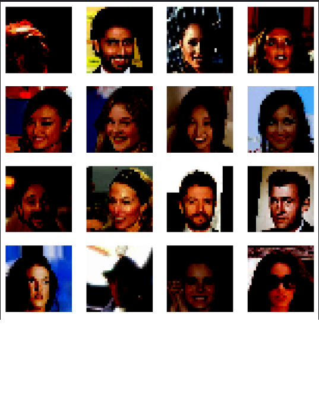
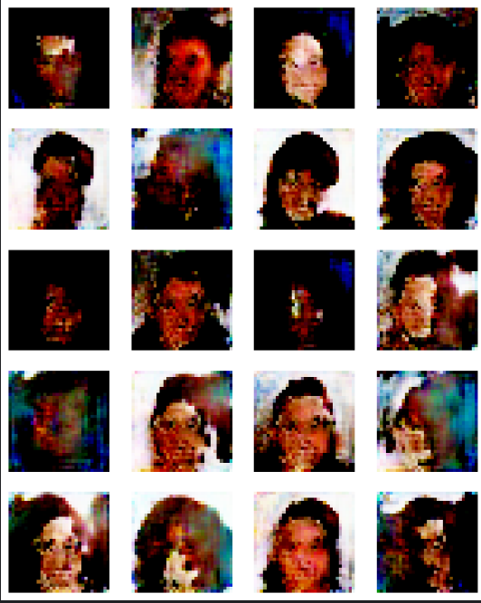
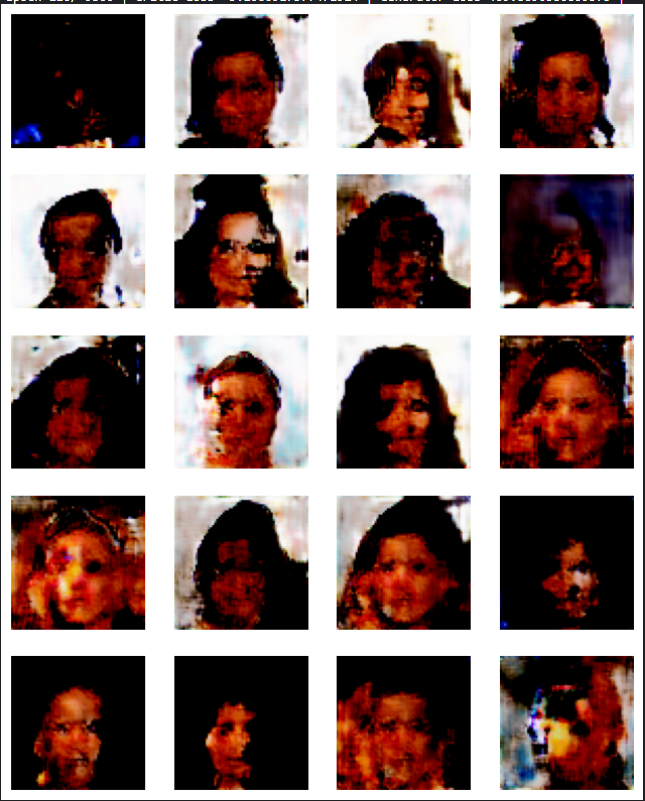

# Progressive GAN Implementation on CelebA Dataset

## Table of Contents

- [Overview](#overview)
- [Progressive GAN](#progressive-gan)
- [Requirements](#requirements)
- [Results](#results)
- [Acknowledgments](#acknowledgments)
- [References](#references)

## Overview

This project is an implementation of the Progressive GAN (Generative Adversarial Network) on the CelebA dataset using TensorFlow 2.0. Progressive GAN is a cutting-edge approach to generating high-quality images progressively, starting from low-resolution images and gradually refining the details. This implementation provides a practical demonstration of Progressive GAN's capabilities in generating high-resolution images.

## Progressive GAN

Progressive GAN is a generative model introduced in the research paper "Progressive Growing of GANs for Improved Quality, Stability, and Variation" by Tero Karras, Timo Aila, Samuli Laine, and Jaakko Lehtinen. The key features of Progressive GAN include:

- Progressive Training: The model is trained incrementally, starting with low-resolution images and progressively adding layers to generate higher-resolution images.

- High-Quality Image Generation: Progressive GAN is known for its ability to generate high-quality images with rich details, making it suitable for various image generation tasks.

- Stability and Variation: The progressive training process improves training stability and enables the generation of diverse images.

## Requirements

- Python 3.7 or later
- TensorFlow 2.0 or higher
- CelebA dataset

## Results

 
*32x32 images generated*
 
 
*64x64 images generated*

Due to limited computational resources, further training of the model was stopped at this stage. While the generated 64x64 images are promising, PGAN has the potential to generate even higher-resolution images with extended training. Future work may involve overcoming resource constraints to continue training and explore larger image sizes.

## Acknowledgments

The Progressive GAN research paper by Karras et al. introduced this approach for high-resolution image generation.

## References

- [Progressive GAN Research Paper](https://arxiv.org/abs/1710.10196)
- [CelebA Dataset](https://www.kaggle.com/datasets/jessicali9530/celeba-dataset)

