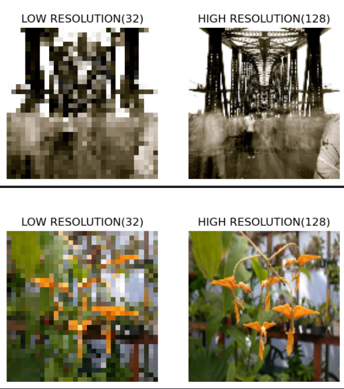
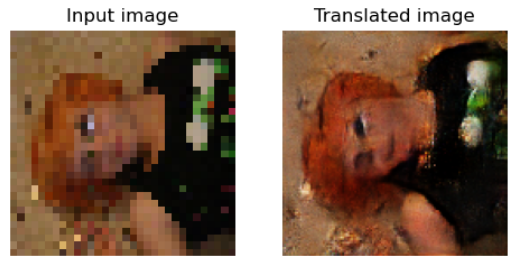
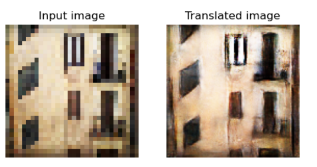
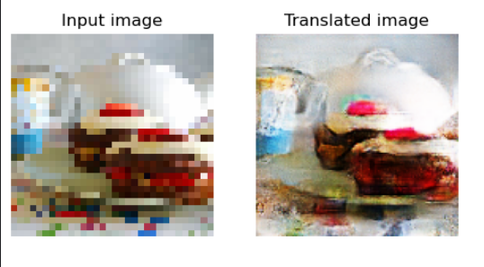

# SRGAN Implementation using TensorFlow

## Table of Contents

- [Overview](#overview)
- [Super-Resolution GAN (SRGAN)](#super-resolution-gan-srgan)
- [Requirements](#requirements)
- [Results](#results)
- [Acknowledgments](#acknowledgments)
- [References](#references)

## Overview

This project is an implementation of the Super-Resolution Generative Adversarial Network (SRGAN) using TensorFlow. SRGAN is a deep learning model designed for enhancing the resolution of images, particularly in the context of upscaling low-resolution images to high-resolution counterparts. This implementation serves as a practical demonstration of SRGAN's potential for generating super-resolved images.

## Super-Resolution GAN (SRGAN)

SRGAN is a generative adversarial network architecture developed to address the problem of single-image super-resolution. The key features of SRGAN include:

- Adversarial Learning: SRGAN utilizes adversarial training, with a generator and discriminator network, to produce high-resolution images that closely resemble real high-resolution images.

- Perceptual Loss: Instead of using traditional pixel-wise loss, SRGAN incorporates a perceptual loss that measures the similarity between the generated and real high-resolution images, enhancing the visual quality of generated images.

- Residual Blocks: The generator network of SRGAN employs residual blocks to effectively capture and upscale image details.

## Requirements

- Python 3.7 or later
- TensorFlow 2.0 or higher

## Results

### Super-Resolved Images

The trained SRGAN model successfully generates super-resolved images, enhancing the visual quality and resolution of input images. Here is a sample of the super-resolved images:

*Caption for Image 1*

*Caption for Image 2*

*Caption for Image 2*

## Acknowledgments

The SRGAN approach builds upon the work of Christian Ledig, Lucas Theis, Ferenc Huszar, and others, as described in their research paper.

## References

- [SRGAN Research Paper](https://arxiv.org/abs/1609.04802)

## Conclusion

In this project, we successfully implemented the Super-Resolution Generative Adversarial Network (SRGAN) using TensorFlow, demonstrating its effectiveness in generating super-resolved images with remarkable improvements in quality and resolution. The utilization of adversarial training, perceptual loss, and residual blocks, as key features of SRGAN, allowed us to enhance the visual fidelity of low-resolution images, making it a valuable tool for a wide range of image enhancement applications.

## Future Work

While this project showcases the capabilities of SRGAN, there are promising avenues for future work:

- **Exploring ESRGAN**: One exciting direction is to explore Enhanced Super-Resolution GANs (ESRGANs) and other advanced methods that can further push the boundaries of super-resolution. ESRGANs have shown potential in achieving even more impressive results by incorporating novel techniques and architectures.

- **Large-Scale Training**: Leveraging more extensive datasets and computational resources to conduct large-scale training can lead to even more impressive super-resolution results. Experimenting with larger and more diverse datasets may uncover the full potential of these models.

- **Real-World Applications**: Applying SRGAN and its variants to real-world applications such as medical imaging, satellite imagery enhancement, and digital content creation can bring practical value. Fine-tuning models for specific domains can lead to significant advancements in image quality.

As we move forward, the pursuit of higher-quality super-resolved images and the exploration of innovative techniques will continue to drive the field of image super-resolution, contributing to a broader range of applications and improving visual content across various domains.
